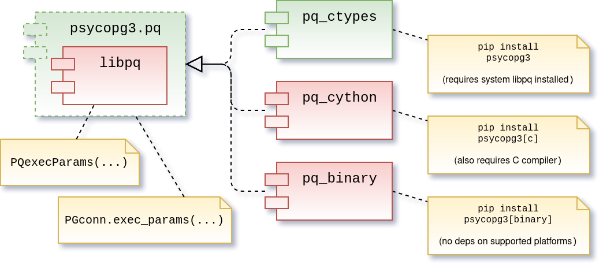
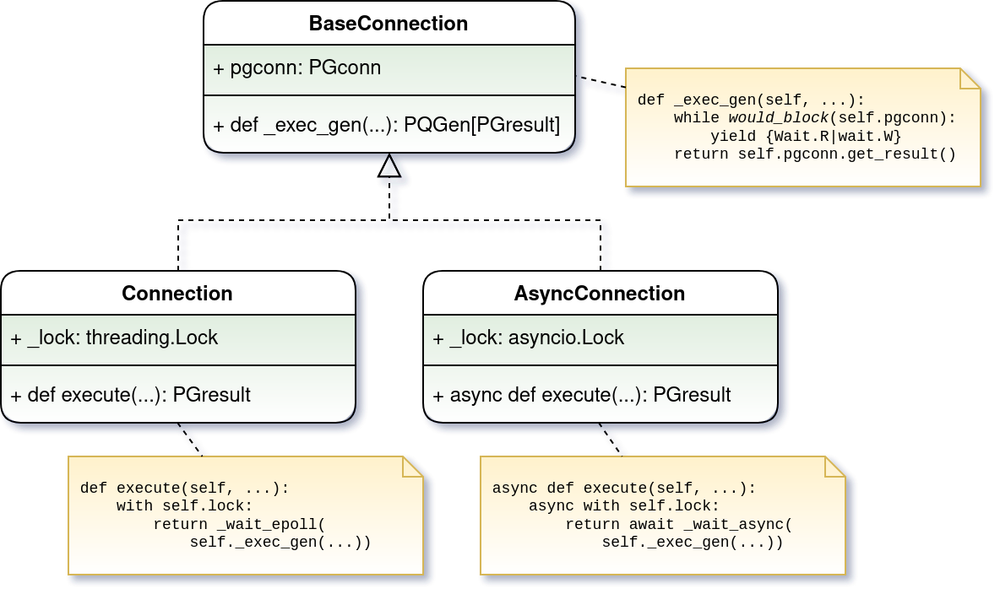
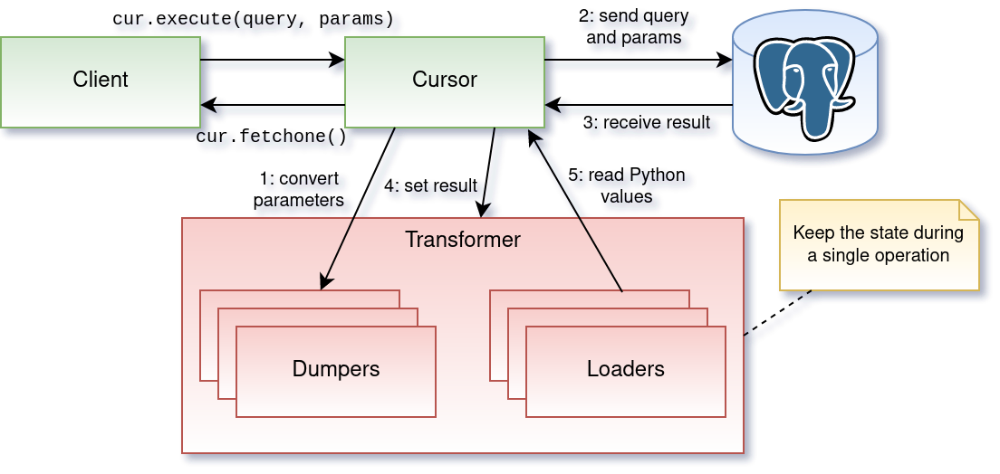
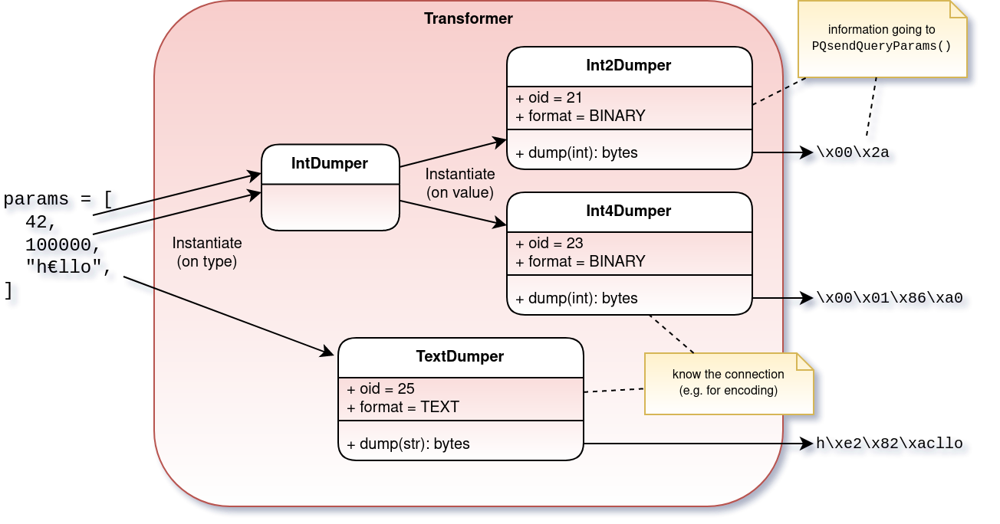
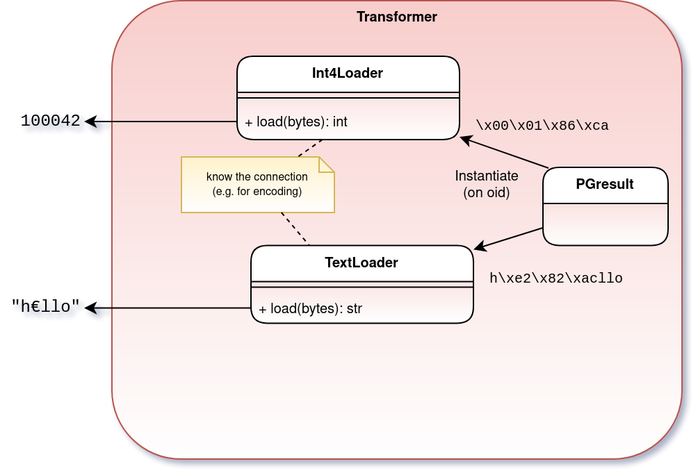
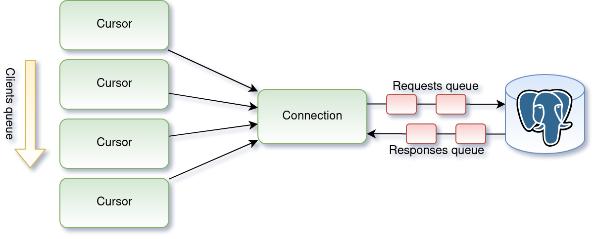

==================================
*psycopg3:* a new generation of...
==================================
...all the love between Python and PostgreSQL
---------------------------------------------

.. class:: text-right

    PGConf.Online 2021, ``'[2021-03-01,2021-03-03]'::daterange``

    Daniele Varrazzo

..
    Note to piro: you want
    :autocmd BufWritePost psycopg.rst :silent !make html

----

What is ``psycopg2``?
=====================

.. class:: font-bigger

    + ⚙️ industry standard Python-PostgreSQL adapter

    + 💪 libpq based

    + ⚖️ 50% C, 50% Python

    + 🐍+🐘=❤️

      + For the 00's, and the 10's...

----

But then, what happened?
========================

.. class:: font-bigger

    + ⏩ The future became present

      + 😖 (some of the past is back biting too...)

    + 🐍 "Where is my ``asyncio``?"

    + 🐘 "Where are my prepared statements??"

    + 😱 "Are you doing client-side binding???"

    + 🖤 the 20's require new forms of love

----

``psycopg2`` problems: Postgres side 🐘
=======================================

* Client-side parameters binding

.. code-block:: python

    cur.execute("SELECT %s, %s", ["hel'lo", 42])
    #                                v       v
    # 1) adapted to              'hel''lo'  42
    # 2) merged to the query

.. code-block:: c

    /* becomes the C call */
    PQexec("SELECT 'hel''lo', 42");

* safe, but cannot be composed more

  * if we want to use COPY we need no quote/escape
  * if we want to prepare we need server-side binding and ``$1``\ -style placeholders

.. code-block:: c

    /* Should become the C call (simplified) */
    PQexecParams(
        "SELECT $1, $2", {25, 23}, {"hel'lo", "42"}, {0, 0}, 0);
    /*         ^            ^            ^     ^      ^  ^   ^
     *       query         oids          params      format  result */

----

``psycopg2`` problems: Python side 🐍
====================================

* Supports multithreads

  * Green threads supported too (``eventlet``, ``gevent``)
  * But interface is blocking by designed (DBAPI v2.0 specs)

.. code-block:: python3

    psycopg2.connect("dbname=piro")     # blocks
    cursor.execute("select foo, bar")   # blocks

* New I/O driven async concurrency

.. code-block:: python3

    await psycopg2.connect("dbname=piro")
    await cursor.execute("select foo, bar")

* ``psycopg2`` is async too... but not ``asyncio``

  * Needs to use ``select()`` or similar

* Confusing use of ``with``:

  * 😅 ``with cursor()`` works as expected (sometimes redundant)
  * 😤 ``with connect()`` doesn't close the connection, only the transaction
  * 😟 ``with pool.getconn()`` missing

----

The new project: ``psycopg3``!
==============================

.. class:: font-bigger

    + 🇳🇿 Started in March 2020 (timidly)
    + 🇮🇹 Almost full time since October 2020 (intensely)
    + 🇬🇧 Expected first release April 2021 (hopefully)
    +  💜 `Contributions and sponsorship welcome`__

.. class:: sponsors

   .. image:: img/sponsors.png
       :width: 500px

.. __: https://github.com/sponsors/dvarrazzo/

----

Want: smooth migration path... 💃
=================================

.. class:: font-bigger

    + major release, backward incompatible

      + server-side binding behave differently: queries need test

    + goal: minimal need to rewrite code

.. code-block:: diff

    --- code2.py
    +++ code3.py
    @@ -1,8 +1,8 @@
    -import psycopg2
    +import psycopg3

    -conn = psycopg2.connect(CONNINFO)
    +conn = psycopg3.connect(CONNINFO)
     cur = conn.cursor()
     cur.execute("SELECT * FROM table")
     print(cur.fetchall())
     cur.close()
     conn.close()

----

...but make use of current idioms 🕺
====================================

.. code-block:: python3

   conn = psycopg2.connect(CONNINFO)
   cur = conn.cursor()
   cur.execute("SELECT * FROM table")
   print(cur.fetchall())
   cur.close()
   conn.close()

   # becomes ...

   with psycopg3.connect(CONNINFO) as conn:
       with conn.cursor() as cur:
           print(cur.execute("SELECT * FROM table").fetchall())

   # ... or even...

   with psycopg3.connect(CONNINFO) as conn:
       res = conn.execute("SELECT * FROM table")
       print(res.fetchall())

* ``with`` is supported in ``psycopg2`` too, but for a less useful pattern
  (transactions)

----

🤓 Design
=========

----

Design: ``libpq`` wrapper
=========================

.. class:: font-bigger

    + Exhaustive access to ``libpq`` interface
    + Can be used on its own

      - Useful for prototyping client-server interaction

----

Design: protocol generators
===========================

* Only non-blocking libpq operations used
* Thin Python wrappers for different interfaces or frameworks (trio__?)

.. __: https://trio.readthedocs.io/en/stable/

----

Design: data adaptation
=======================

* An explicit place to keep the state during querying
* Used everywhere to convert Python/Postgres data (COPY, composite types...)

----

Design: sending data to DB
==========================

* ``cur.execute("select %s + %s, %s", [42, 100_000, "h€llo"])``
* The Python type is not always sufficient to decide the Postgres type

  * Python ``datetime`` can be ``timestamp`` or ``timestamptz``
  * Python ``list`` can be an ``ARRAY[]`` of any type...

----

Design: receiving data from DB
==============================

* ``cur.execute("select %s + %s, %s", [42, 100_000, "h€llo"])``
* Type OID used to choose the ``Loader`` class

----

😍 Features
===========

----

Support for ``asyncio`` 🏹
==========================

.. class:: font-bigger

    + Allows for collaborative parallelism

      - Control flow switch when I/O is performed

    + Available in current Python 3 versions

.. code-block:: python3

   from psycopg3 import AsyncConnection

   async with AsyncConnection.connect(CONNINFO) as conn:
       cur = await conn.execute("SELECT * FROM table")
           print(await cur.fetchall())

.. class:: font-bigger

    + New frameworks being built on it

      + FastAPI is great  🚀

----

Transactions as blocks 🤝
=========================

.. class:: font-bigger

    + Support for transactions (nested, with ``SAVEPOINT``)

.. code-block:: python3

    conn = psycopg3.connect(CONNINFO)

    with conn.transaction() as tx1:
        num_ok = 0
        for operation in operations:
            try:
                with conn.transaction() as tx2:
                    unreliable_operation(conn, operation)
            except Exception:
                logger.exception(f"{operation} failed")
            else:
                num_ok += 1

        save_number_of_successes(conn, num_ok)

.. class:: font-bigger

    + ``raise Rollback(tx)`` also supported to jump out of a block.

    + Thank you `@asqui`__!

    .. __: https://github.com/asqui/

----

COPY with Python objects 🚛
===========================

.. class:: font-bigger

    + Supports text and binary format
    + Copy by record (Python values) or block (preformatted)
    + Allow for async COPY (if producer/consumer is async)

.. code-block:: python3

    records = [(10, 20, "hello"), (40, None, "world")]

    with cursor.copy(
        "COPY sample (col1, col2, col3) FROM STDIN"
    ) as copy:
        for record in records:
            copy.write_row(record)

.. code-block:: python3

    with open("data.out", "wb") as f:
        with cursor.copy("COPY table_name TO STDOUT") as copy:
            for data in copy:
                f.write(data)

----

Notifications 💌
================

.. class:: font-bigger

    + Receive messages about e.g. changed data

.. code-block:: python3

    import psycopg3

    conn = psycopg3.connect(CONNINFO, autocommit=True)
    conn.cursor().execute("LISTEN mychan")

    gen = conn.notifies()
    for notify in gen:
        print(notify)
        if notify.payload == "stop":
            gen.close()

    print("there, I stopped")

.. code-block:: sql

   =# notify mychan, 'hey';
   NOTIFY
   =# notify mychan, 'stop';
   NOTIFY

.. code-block:: python3

   Notify(channel='mychan', payload='hey', pid=961823)
   Notify(channel='mychan', payload='stop', pid=961823)
   there, I stopped

----

Prepared query 🍳
==================

.. class:: font-bigger

    + Queries automatically prepared when seen repeatedly

.. code-block:: python3

   conn.execute(query, params, prepare=None)
   cur.execute(query, params, prepare=None)

* ``prepare=True``: prepare the query immediately
* ``prepare=False``: don't prepare the query
* ``prepare=None``: prepare the query automatically after seeing it a
  few times (default)
* ``connection.prepare_threshold``: how many times to see a query before
  preparing it automatically (default: 5)
* ``connection.prepared_max``: max number of queries to prepare before
  evicting the least recently used (default: 100)

----

A new connection pool 🏊
========================

.. class:: font-bigger

    + Using the performing Java HikariCP__ for inspiration
    + Queue of waiting client, timeout on ``getconn()``
    + Background workers for maintenance/inspection
    + ``with pool.connection()`` context manager

.. __: https://github.com/brettwooldridge/HikariCP

----

😎 The future
=============

----

Streaming query 🌊
=================

.. class:: font-bigger

    + A query that never ends!

      - Using libpq single-row mode

    + Not implemented yet in PostgreSQL

      - CockroachDB `CHANGEFEED FOR`__

      - Materialize TAIL__

    .. __: https://www.cockroachlabs.com/docs/stable/changefeed-for.html
    .. __: https://materialize.com/docs/sql/tail/#main

.. code-block:: python3

   query = f"TAIL {self.view_name} WITH (PROGRESS)"

   async for (timestamp, progressed, diff, *columns) \
           in cursor.stream(query):
       ...

----

Pipeline/batch mode 🚂
======================

.. class:: font-bigger

    + Planned in ``psycopg3``

    + In commitfest, scheduled for v14

      - https://commitfest.postgresql.org/30/2724/

    + libpq-only changeset, supported by all server versions

----

Binary JSONB 🌍
================

.. class:: font-bigger

    + Currently JSONB is transferred in text format

      + serializing, escaping on the server

      + de-serializing on the client

    + Preliminary result show big speedup using JSONB transfer

      + In collaboration with PostgresPro

      + https://github.com/dvarrazzo/jsonb_parser

    + Let's make PostgreSQL a NoNoSQL database! 🖤

========== ============= =========================================
Parser     Time          Notes
========== ============= =========================================
jsonb      4.081119 sec  Decoding using Python json module
orjson     2.722768 sec  Decoding using the faster ``orjson`` module
jsonb-disk 1.101547 sec  Decode the on-disk JSONB format on client
========== ============= =========================================

----

🤔 Questions?
=============
